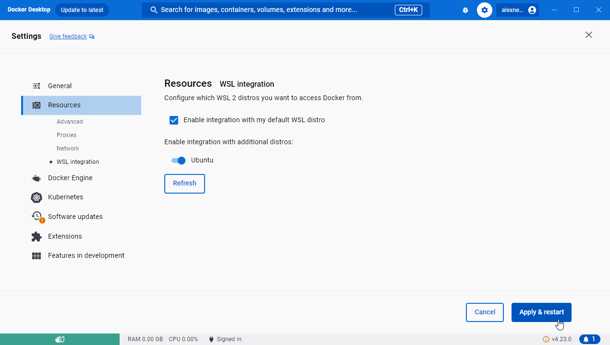

# shmurple
An open source virtual tabletop RPG / MUD world created using evennia so I can get python practice. 

## Goals
1. I learn python syntax and conventions
1. I have a GM tool that I can use to track where my players are in my designated game world
1. I can share some GM prep I did so other GMs don't have to prep
1. (stretch) players can login and see their general location details / rooms / basic interactables with the GM pre-programming what happens if they try to pickup items etc. so we can automate the bookkeeping / slow combat part and instead focus on GM orchestrating story and NPCs and happenstance. Think an MMO but where you have a server staffer / game designer following you live and tweaking the game in direct response to you. 

## Built-in credentials

Username | password | notes
--- | --- | ---
Trombone | Patronize-Unmatched4 | Superuser account (email is blank)

## Code Style

I'm following this for now: https://www.evennia.com/docs/latest/Coding/Evennia-Code-Style.html

### Docstring quick ref

```python
    """
    Args
        argname (freeform type): Description ended with period.
    Keyword Args:
        argname (freeform type): Description.
    Returns/Yields:
        type: Description.
    Raises:
        Exceptiontype: Description.
    Notes/Note/Examples/Example:
        Freeform text.
    """
```

## Development setup from scratch

We want to do docker-based development so we are not fighting with python on windows vs Linux etc. Overall we are following https://www.evennia.com/docs/latest/Setup/Installation.html but with tweaks to help windows folks get up to speed. 

### Windows

1. Install VS Code
1. Install git
1. Open a command line interface, this assumes you are running `git bash`
1. Installing WSL per https://learn.microsoft.com/en-us/windows/wsl/install
    1. `wsl --install` or if you already have WSL `wsl --update`
    1. `wsl --install -d ubuntu`
    1. `wsl --setdefault Ubuntu` if you are only using WSL2 for this project per https://pureinfotech.com/set-default-distro-wsl2-windows-10/
1. Setting up WSL environment first time per https://learn.microsoft.com/en-us/windows/wsl/setup/environment#set-up-your-linux-username-and-password
    1. set username to be what you want (`user` for example)
    1. set password to be what you want (`hunter2` for example)
    1. refresh your distro by running its updates. if you did ubuntu then do `sudo apt update; sudo apt upgrade` and confirm any prompts to continue
    1. go into docker desktop
    1. towards the top right of the title bar, select the gear / settings icon
    1. on the sidebar of the settings window, select Resources
    1. in the subsections of Resources, select WSL integration
    1. in the section labelled WSL integration, flip the switch next to the WSL you installed (ubuntu if you followed this example)
    1. click apply & restart
        
1. In your command line, run `wsl`
1. `cd /mnt/c/source/shmurple` aka CD into whatever directory you cloned the repo into
1. `docker pull evennia/evennia`
1. `docker run -it --rm -p 4000:4000 -p 4001:4001 -p 4002:4002 --rm -v ./gamedir:/usr/src/game --user $UID:$GID evennia/evennia`
1. In the pop up for Windows firewall, enable docker desktop on private networks
    
1. You should now be inside the evennia container and able to `touch test` a file and see it reflected in your local filesystem
1. Press Ctrl + D or type `exit` to exit the container and be back in wsl shell
1. `docker build -t local-shmurple .` to build this dockerfile per https://www.evennia.com/docs/latest/Setup/Installation-Docker.html#create-your-own-game-image
1. `docker run -it --rm -p 4000:4000 -p 4001:4001 -p 4002:4002 --rm -v ./gamedir:/usr/src/game --user $UID:$GID local-shmurple` and you should have your own local copy of shmurple running
1. Now you can hit the local web client at `http://localhost:4001/webclient`
1. Go to the input textbox in the bottom of the window, type in `connect Trombone Patronize-Unmatched4`