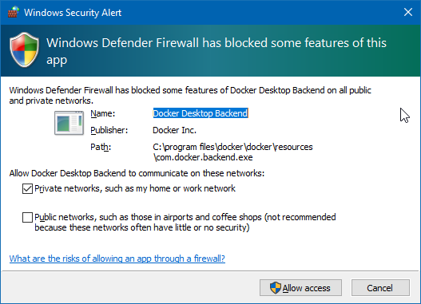

# shmurple
An evennia thing

## Development setup from scratch

### Windows

1. Install VS Code
1. Install git
1. Install Docker Desktop
1. Sign in to Docker Desktop
1. Open a command line interface, this assumes you are running `git bash`
1. `cd C:\source\shmurple` aka CD into whatever directory you cloned the repo into
1. `docker pull evennia/evennia`
1. `docker run -it --rm -p 4000:4000 -p 4001:4001 -p 4002:4002 --rm -v ./gamedir:/usr/src/game --user $UID:$GID evennia/evennia`
1. In the pop up for Windows firewall, enable docker desktop on private networks
    
